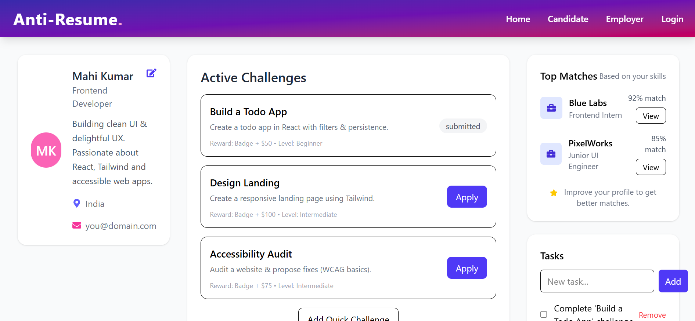

# 🧠 Anti-Resume Job Platform

### 🚀 Rethinking hiring — where **skills**, **projects**, and **performance** matter more than a resume.


---

## 🌟 Overview

**Anti-Resume** is a next-generation recruitment platform that removes traditional resumes from the hiring process.  
Instead of listing credentials, candidates showcase **real challenges**, **project submissions**, and **skills** — while employers make hiring decisions based on **performance analytics**.

**Live Demo:** [AntiResume on Vercel](https://ft-web-team-19-anti-resume-job-platform-git-main-mahi2.vercel.app/)
---

## 🧩 Features

### 🧑‍💻 Candidate Side

- 🪪 **Profile Management** – editable bio, skills, and location.
- 🧠 **Challenges Section** – live coding/design challenges fetched from Firestore.
- 🏆 **Matches & Tasks** – real-time dashboard with opportunities.
- 💾 **Auto Save (localStorage)** for offline persistence.

### 🏢 Employer/Admin Side

- 📊 **Analytics Dashboard** – track candidate performance & hiring metrics (Recharts).
- 💼 **Position Management** – create, edit, and monitor open roles.
- 🧮 **Manage Challenges** – full CRUD (Add/Edit/Delete) synced to Firestore.
- 🧠 **Role-Based Access Control** – candidates, employers, and admins see only their relevant features.

### 🔐 Authentication

- Firebase Email/Password Authentication
- Auto session persistence
- Protected routes with `PrivateRoute.jsx`
- Role-based access via Firestore + AuthContext

### 🎨 UI / UX

- Built with **TailwindCSS** for modern responsive design
- Mobile-first layouts
- Clean animations & sticky navigation
- Consistent gradient themes

---

## 🏗️ Tech Stack

| Category         | Tools                               |
| ---------------- | ----------------------------------- |
| Frontend         | React 18, Vite, React Router DOM    |
| Styling          | TailwindCSS, React Icons            |
| State Management | Context API                         |
| Charts           | Recharts                            |
| Backend / Auth   | Firebase Auth                       |
| Database         | Firestore (Realtime + Secure Rules) |
| Hosting          | Firebase Hosting / Vercel           |

---

## ⚙️ Folder Structure

src/
┣ components/
┃ ┣ candidate/
┃ ┃ ┣ ProfileCard.jsx
┃ ┃ ┣ Challenges.jsx
┃ ┃ ┗ TasksPanel.jsx
┃ ┣ admin/
┃ ┃ ┗ ManageChallenges.jsx
┃ ┣ Navbar.jsx
┃ ┣ Footer.jsx
┃ ┗ PrivateRoute.jsx
┣ context/
┃ ┗ AuthContext.jsx
┣ pages/
┃ ┣ Landing.jsx
┃ ┣ Login.jsx
┃ ┣ Signup.jsx
┃ ┣ CandidateDashboard.jsx
┃ ┗ EmployerDashboard.jsx
┣ utils/api/
┃ ┗ firebase.js
┣ hooks/
┃ ┗ useLocalData.js
┗ App.jsx

---

## 🛠️ Setup Instructions

### 1️⃣ Clone the repository

```bash
git clone https://github.com/yourusername/anti-resume-platform.git
cd anti-resume-platform

npm install

3️⃣ Setup Firebase

Go to Firebase Console

Create a project → Enable Firestore and Authentication

Copy your Firebase config and paste it into
src/utils/api/firebase.js:

import { initializeApp } from "firebase/app";
import { getFirestore } from "firebase/firestore";

const firebaseConfig = {
  apiKey: "YOUR_KEY",
  authDomain: "YOUR_DOMAIN",
  projectId: "YOUR_PROJECT_ID",
  storageBucket: "YOUR_BUCKET",
  messagingSenderId: "YOUR_SENDER_ID",
  appId: "YOUR_APP_ID",
};

export const app = initializeApp(firebaseConfig);
export const db = getFirestore(app);

4️⃣ Run the development server
npm run dev


Then visit → http://localhost:5173/

5️⃣ Build for production
npm run build

6️⃣ Deploy (Firebase Hosting or Vercel)
# Firebase example
firebase login
firebase init hosting
firebase deploy


```

## 🧩 Tech Architecture Overview

The diagram below illustrates how different parts of the Anti-Resume Platform work together — from authentication to dashboard rendering and Firestore data flow.

### graph TD

```bash
%% === Core Structure ===
A[👤 User] -->|Login / Signup| B[Firebase Auth]
A -->|Updates Profile| E[Firestore Database]
A -->|Interacts with| D[React Frontend (Vite + Tailwind)]

    %% === Auth Flow ===
    B -->|Session Token| C[AuthContext.jsx]
    C -->|Provides user + role| D
    C -->|Validates| F[PrivateRoute.jsx]

    %% === Data Layer ===
    D -->|Fetch / Listen| E
    E -->|Realtime Updates| D

    %% === Dashboards ===
    D -->|Candidate Role| G[Candidate Dashboard]
    D -->|Employer Role| H[Employer Dashboard]
    D -->|Admin Role| I[Admin Panel / Manage Challenges]

    %% === Data Collections ===
    E -->|users / candidates| G
    E -->|positions / companies| H
    E -->|challenges| I

    %% === Hosting ===
    D -->|Deployed on| J[Vercel / Firebase Hosting]

    %% Styling and Design
    D -->|Tailwind + Recharts| K[UI & Data Visualization Layer]

    %% Styling and group nodes
    classDef frontend fill:#8b5cf6,stroke:#fff,stroke-width:1px,color:#fff;
    classDef backend fill:#fbbf24,stroke:#fff,stroke-width:1px,color:#000;
    classDef infra fill:#10b981,stroke:#fff,stroke-width:1px,color:#fff;

    class D,G,H,I,K frontend;
    class B,C,E backend;
    class J infra;

```

## 🧑‍💼 Role-Based Access

Role: Access
candidate: Profile, Challenges, Matches, Tasks
employer: Candidates, Positions, Analytics, Company
admin: Manage Challenges, Analytics, All Dashboards

## 🚀 Upcoming Features

### 🧠 AI-based candidate skill analysis

### 💬 Real-time chat between employers and candidates

### 📁 Resume-less hiring API integration

### 📈 Enhanced analytics dashboard with leaderboard

## 🤝 Contributing

Pull requests are welcome!
For major changes, please open an issue first to discuss what you’d like to change.

```bash
git checkout -b feature/new-component
git commit -m "Added new feature"
git push origin feature/new-component
```

## 📸 Screenshot




## 🧑‍💻 Author

### Mahendra Kumar Sahu

Frontend Developer | React & Firebase Enthusiast

## 📄 License

This project is licensed under the MIT License — feel free to use and modify it.
